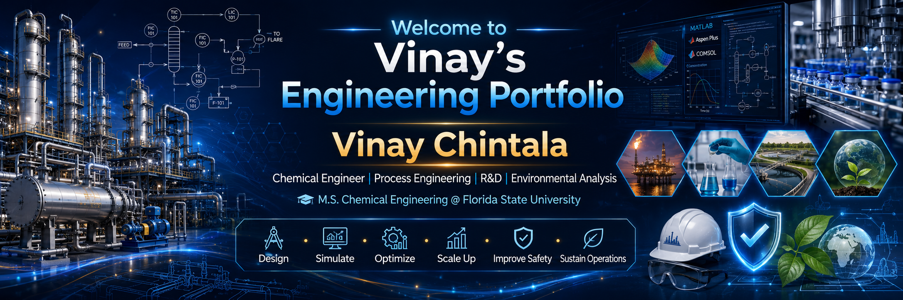

<h1 align="center">Hi 👋, I'm Vinay Chintala</h1>
<h3 align="center">Process Engineer | Chemical Engineering M.S. @ Florida State University</h3>

  

  
  
  

---

### 🧪 SUMMARY

I'm a Chemical Engineering M.S. student at Florida State University with hands-on experience spanning wastewater treatment, petroleum operations, pharmaceutical manufacturing, and compliance-style technical documentation. My background bridges process safety, environmental compliance, and quality assurance with strong technical reporting and data analysis skills — I like turning messy plant data and process constraints into clear, defensible engineering decisions.

Currently exploring heavy oil recovery and refinery integration strategy, with prior work reducing cycle times and water usage in pharmaceutical batch manufacturing, tuning control models in MATLAB, and reviewing gas terminal operations processing 7 million cubic meters/day.

- 🔬 M.S. in Chemical Engineering, Florida State University (GPA 3.5/4.0)
- 🎓 B.Tech in Chemical Engineering, Osmania University (GPA 3.2/4.0)
- 🏆 GATE 2023 Qualified — All India Rank 2021 in Chemical Engineering
- 🌱 Currently deepening my skills in process safety (SAChE) and Six Sigma methodology
- 📫 Reach me at **vinaychemy@gmail.com** or **+1 (448) 200-7987**

---

### ⚙️ TECHNICAL SKILLS

**Environmental & Compliance**

**Petroleum & Process Systems**

**Data & Reporting**

**Tools & Software**

---

### 💼 EXPERIENCE

**Research Assistant** — *Florida State University* (Nov 2025 – May 2026)
- Tested polymer samples to study behavior under heat and mechanical stress
- Operated 3D printers and testing equipment supporting ongoing research experiments

**Process Engineering Apprentice** — *Dr. Reddy's Laboratories* (Oct 2023 – Mar 2024)
- Reviewed capacity-improvement work that increased monthly output from **135 → 165 tonnes**
- Tracked cycle-time reductions of key batch steps from **16 → 12 hours**
- Assessed wash-water reduction from **15,000 → 10,000 liters** per batch

**Research Assistant** — *Osmania University* (Jan 2023 – Sep 2023)
- Built a MATLAB dual-tank liquid-level control model
- Improved control accuracy by **58%**, reduced settling time by **15%**, cut overshoot by **98%** vs. baseline PID

**Process Engineering Intern** — *Oil and Natural Gas Corporation Ltd* (May 2022 – Oct 2022)
- Reviewed onshore gas terminal operations processing **7 million m³/day**
- Studied 3-stage compressor systems, glycol drying, and regeneration processes

**Environmental Engineering Intern** — *Terra Green Technologies Pvt. Ltd* (Mar 2022 – May 2022)
- Analyzed industrial/urban wastewater treatment including RO systems and oil-water separation

---

### 🚀 FEATURED PROJECT

### 🚀 FEATURED PROJECTS

#### 🏭 Sodium Lauryl Sulfate Plant Design

Designed a **150 kg/day** SLS plant covering sulphonation, neutralization, spray drying, equipment sizing, and economic evaluation.

- Performed material and energy balances
- Sized reactors, storage tanks, and centrifugal pumps
- Estimated **$4.56 million** capital investment
- Calculated a **2.36-year** payback period

[📄 View Complete SLS Project Report](https://drive.google.com/file/d/1Gvsrfwa9Oaqdxexh4NjqaVnk73zrbEhX/view?usp=sharing)

---

#### 🛢️ Heavy Oil Recovery & Refinery Integration

Developed a three-stage screening framework comparing recovery methods based on reservoir feasibility, surface constraints, logistics, and refinery compatibility.

[📄 View Complete Heavy Oil Project Report](https://drive.google.com/file/d/1MC2HqGoiyraiCbOwrtZrd5APleZhwfXe/view?usp=sharing)

---

#### 🌊 Food Dye Diffusion Analysis

Led a five-member team modeling radial diffusion in water and gelatin using ImageJ and MATLAB.

[📄 View Complete Transport Project Report](https://drive.google.com/file/d/1IL_6RKJPeuoRWw6CArouquDKh9oDyfRP/view?usp=sharing)

---

### 📜 CERTIFICATIONS

| Certification | Date |
|---|---|
| SAChE Managing Lab Process Safety 1 & 2 | May 2026 |
| Six Sigma: Green Belt | Jan 2026 |
| MATLAB Onramp | Aug 2025 |
| Computational Process Design | Apr 2024 |
| Aspen HYSYS | Nov 2023 |
| Aspen Plus Simulation | Oct 2023 |
| Nanomaterials for Energy Harvesting and Storage Applications | Aug 2023 |
| Simulink Onramp | Jun 2023 |

---

  <i>Thanks for stopping by — let's connect!</i>

